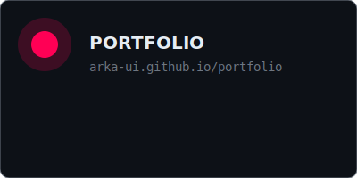
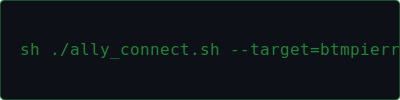

  

 

  

 

  <h3>Network / Allies</h3>
  

   
  
   
  

 

  <code>
    Running system_update.exe... [██████████] 100% 
    > TypeScript environment loaded. 
    > Welcome to the profile.
  </code>

